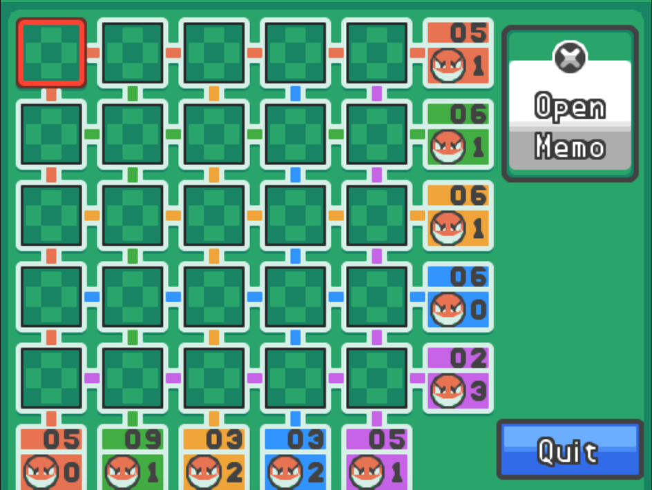

# Pokemon Casino Helper
 A helper to win at the casino in Pokemon Hearth Gold and Soul Silver

## Dependencies

* Python 3
* Numpy

```bash
pip install numpy
```

## How to use

First, start the helper:

```bash
python3 main.py
```

The first thing the helper will ask is to put the numbers the casino game gives you. Input the numbers one at a time, vertical first then horizontal ones. In the following screenshot, you would hence have to input:



```
5
1
6
1
6
1
6
0
2
3
5
0
9
1
3
2
3
2
5
1
```

If there is a row/column with 0 bombs and more than 5 points, the game will ask you to input the values of those spots as well by askin for the value at a specific coordinate $(x, y)$. Then let some time for the algorithm to think. This is the only loading time, the amount depends on the game. The game will then ask you to input values it thinks are not voltorbs, providing the chances of loosing for that specific spot. If you decide to flip another spot instead, input `s`. It will then ask for the coordinates and the value.

